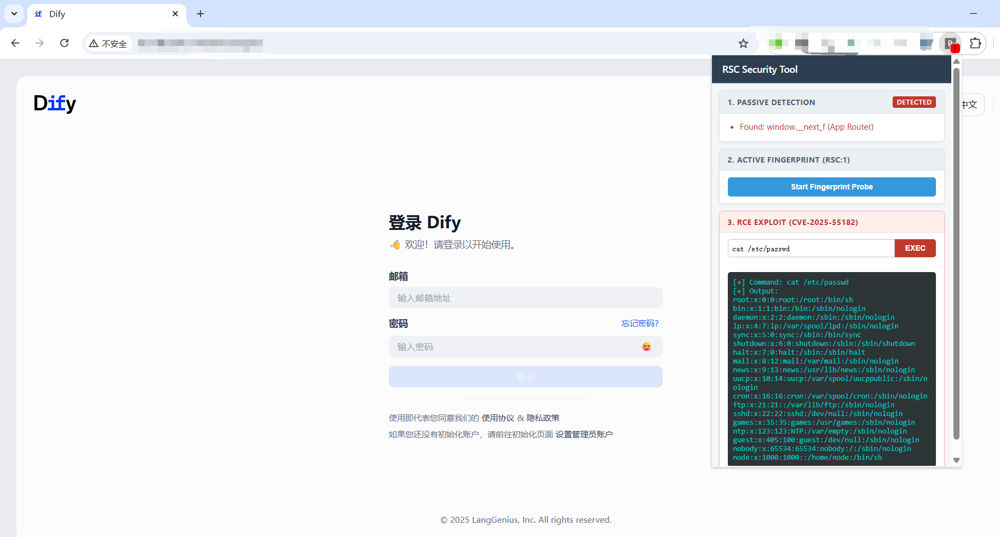

# RSC-SECURITY-TOOL
A Chrome extension for detecting React Server Components (RSC) and Next.js App Router fingerprints on web pages.

## ⚠️ Important Notice

This extension is designed for **educational and security research purposes only**. It includes functionality that could be used to test for security vulnerabilities. **Only use this extension on systems you own or have explicit permission to test.** Unauthorized use may be illegal and unethical.

## Features

### 🔍 Passive Detection
- Automatically scans web pages for RSC indicators
- Detects Next.js App Router patterns
- Monitors page content for RSC-specific markers
- Updates extension badge when RSC is detected

### 🎯 Active Fingerprinting
- Sends controlled RSC probe requests
- Analyzes server responses for RSC characteristics
- Identifies Content-Type headers indicating RSC usage
- Detects Vary headers containing 'RSC'

### 📊 Detection Methods

The extension uses multiple detection techniques:

1. **Content-Type Analysis**: Detects `text/x-component` responses
2. **Pattern Matching**: Identifies `window.__next_f` and RSC-related patterns
3. **Header Inspection**: Analyzes Vary headers for RSC indicators
4. **Response Structure**: Checks for React Flight Protocol patterns

## Installation

### From Source
1. Clone this repository:
   ```bash
   git clone https://github.com/xploithunter5/RSC-SECURITY-TOOL.git
   cd RSC-SECURITY-TOOL
   ```

2. Load the extension in Chrome:
   - Open Chrome and go to `chrome://extensions/`
   - Enable "Developer mode" (toggle in top right)
   - Click "Load unpacked"
   - Select the RSC-SECURITY-TOOL folder

## Usage

1. **Automatic Detection**: The extension automatically scans pages as you browse
2. **Manual Probe**: Click the extension icon and use the "Start Fingerprint Probe" button
3. **View Results**: Check the popup for detection results and detailed information

### Screenshot



The screenshot above shows the extension running when RSC is detected, including passive detection results and active probing functionality.

## File Structure

```
RSC-SECURITY-TOOL/
├── manifest.json          # Extension configuration
├── content.js             # Main detection logic
├── popup.html             # Extension popup interface
├── popup.js               # Popup functionality
├── background.js          # Background service worker
├── rules.json             # Network request rules
├── images/
│   └── img1.png          # Extension screenshot
└── README.md             # This file
```

## Technical Details

### Detection Patterns

The extension looks for:

- **Content-Type**: `text/x-component`
- **Global Variables**: `window.__next_f`
- **Library References**: `react-server-dom-webpack`
- **Response Headers**: `Vary: RSC`
- **Protocol Patterns**: React Flight Response format

### Permissions

The extension requires:
- `activeTab` - Access current tab content
- `scripting` - Execute scripts on pages
- `declarativeNetRequest` - Modify network requests
- `<all_urls>` - Work on all websites

## Contributing

Contributions are welcome. Please ensure any changes:
- Maintain the educational/research focus
- Include proper documentation
- Follow Chrome extension best practices

## License

This project is provided for educational purposes. Use responsibly and in accordance with applicable laws and regulations.

## Disclaimer

This tool is designed for legitimate security research and educational purposes. Users are responsible for ensuring they have proper authorization before testing any systems. The authors are not responsible for misuse of this software.

## Documentation

- **English**: This file (README.md)

---


**⚠️ For authorized security testing only**


